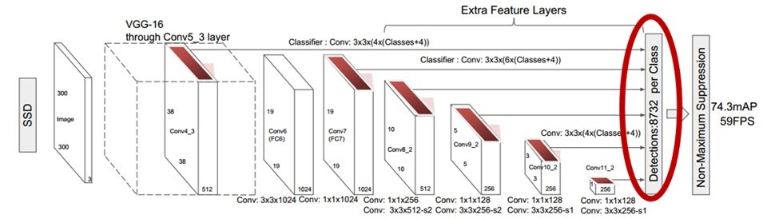

# A port of [SSD: Single Shot MultiBox Detector](https://github.com/weiliu89/caffe/tree/ssd) to [Keras](https://keras.io) framework.
For more details, please refer to [arXiv paper](http://arxiv.org/abs/1512.02325).

For forward pass for 300x300 model, please, follow `SSD.ipynb` for examples. For training procedure for 300x300 model, please, follow `SSD_training.ipynb` for examples. Moreover, in `testing_utils` folder there is a useful script to test `SSD` on video or on camera input.

Weights are ported from the original models and are available [here](https://mega.nz/#F!7RowVLCL!q3cEVRK9jyOSB9el3SssIA). You need `weights_SSD300.hdf5`, `weights_300x300_old.hdf5` is for the old version of architecture with 3x3 convolution for `pool6`.

This code was tested with `Keras` v2.1.6, `Tensorflow` v1.7.0, `OpenCV` v3.1.4
