# SSD-based object and text detection with Keras
This repository contains the implementation of various approaches to object detection in general and text detection/recognition in particular.

Its code was initially used to carry out the experiments for the author's master thesis [End-to-End Scene Text Recognition based on Artificial Neural Networks](http://83.169.39.135/thesis/thesis.pdf) and later extended with the implementation of more recent approaches.

## Technical background

Most of the ideas used for this project go back to the following papers:

#### SSD: Single Shot MultiBox Detector [arXiv:1512.02325](https://arxiv.org/abs/1512.02325)
SSD is a generic object detector that does local regression and classification on multiple feature maps of a CNN to predict a dense population of bounding boxes, which are subsequently filtered by a confidence threshold and NMS.

#### TextBoxes: A Fast Text Detector with a Single Deep Neural Network [arXiv:1611.06779](https://arxiv.org/abs/1611.06779)
TextBoxes is a modification of SSD that uses non-square convolution kernels and prior boxes with a large aspect ratio to better detect horizontal text.

#### DSOD: Learning Deeply Supervised Object Detectors from Scratch [arXiv:1708.01241](https://arxiv.org/abs/1708.01241)
DSOD is a modification of SSD that uses DenseNet as backbone architecture and thus can be trained form scratch instead of depending on a pretrained VGG-16 model.

#### Detecting Oriented Text in Natural Images by Linking Segments [arXiv:1703.06520](https://arxiv.org/abs/1703.06520)
SegLink builds on SSD and detects oriented text by locally predicting text segments (objects in SSD) and there linking with each other. The segments (edges) and links (vertices) are considered as a graph and thresholded by confidence. The remaining groups are finally combined to form bounding boxes.

#### TextBoxes++: A Single-Shot Oriented Scene Text Detector [arXiv:1801.02765](https://arxiv.org/abs/1801.02765)
TextBoxes++ extends TextBoxes for arbitrary oriented text by predicting horizontal bounding boxes as well as quadrilaterals and oriented bounding boxes. It additionally uses the recognition score to eliminate false positives from the detection stage (currently not implemented).

#### Focal Loss for Dense Object Detection [arXiv:1708.02002](https://arxiv.org/abs/1708.02002)
The focal loss is a dynamically weighted version of the cross entropy loss that can better handle a large imbalance between the classes and focus the training process on the difficult samples. It can be applied to the aforementioned detectors, instead of hard negative mining, to overcome the dominance of the background class.

#### An End-to-End Trainable Neural Network for Image-based Sequence Recognition and Its Application to Scene Text Recognition [arXiv:1507.05717](https://arxiv.org/abs/1507.05717)
CRNN is a relatively simple architecture with some convolutional-pooling blocks, followed by two bidirectional LSTM (GRU in this implementation) layers, which can be trained with a CTC for efficient text recognition. It can be used to read the text in the cropped bounding boxes generated by the text detectors mentioned above.

## Supported datasets
Currently supported datasets for object detection are

- PASCAL VOC
- MS COCO

and supported datasets related to text are

- ICDAR2015 FST
- ICDAR2015 IST
- SynthText
- MSRA TD500
- SVT
- COCO Text

For more information about the datasets, see [datasets.ipynb](datasets.ipynb).

## Dependencies
For suitable versions of the necessary dependencies, see [environment.ipynb](misc/environment.ipynb).

## Usage
The usage of the code is quite straightforward, clone the repository and run the related Jupyter notebooks. Some of the scripts (e.g. for video and model conversion) can also be executed form the command line.

## Pretrained models
Pretrained SSD models can be converted from the [original Caffe implementation](https://github.com/weiliu89/caffe/tree/ssd).

#### [Converted SSD300 VOC](http://83.169.39.135/ssd_detectors/ssd300_voc_weights_fixed.zip)
PASCAL VOC 07+12+COCO SSD300* from Caffe implementation

#### [Converted SSD512 VOC](http://83.169.39.135/ssd_detectors/ssd512_voc_weights_fixed.zip)
PASCAL VOC 07+12+COCO SSD512* from Caffe implementation

#### [Converted SSD300 COCO](http://83.169.39.135/ssd_detectors/ssd300_coco_weights_fixed.zip)
COCO trainval35k SSD300* from Caffe implementation

#### [Converted SSD512 COCO](http://83.169.39.135/ssd_detectors/ssd512_coco_weights_fixed.zip)
COCO trainval35k SSD512* from Caffe implementation

#### [SegLink](http://83.169.39.135/ssd_detectors/201809231008_sl512_synthtext.zip)
initialized with converted SSD512 weights  
trained and tested on subsets of SynthText  
segment_threshold 0.60  
link_threshold    0.25  
precision         0.884  
recall            0.853  
f-measure         0.868  

#### [SegLink with DenseNet and Focal Loss](http://83.169.39.135/ssd_detectors/201806021007_dsodsl512_synthtext.zip)
trained and tested on subsets of SynthText  
segment_threshold 0.55  
link_threshold    0.45  
precision         0.940  
recall            0.904  
f-measure         0.922  

#### [TextBoxes++ with DennseNet and Focal Loss](http://83.169.39.135/ssd_detectors/201807091503_dsodtbpp512fl_synthtext.zip)
trained and tested on subsets of SynthText  
threshold         0.35  
precision         0.901  
recall            0.931  
f-measure         0.916  

#### [CRNN with LSTM](http://83.169.39.135/ssd_detectors/201806162129_crnn_lstm_synthtext.zip)
trained and tested on cropped word level bounding boxes form SynthText  
mean editdistance             0.332  
mean normalized editdistance  0.081  
character recogniton rate     0.916  
word recognition rate         0.861  

#### [CRNN with GRU](http://83.169.39.135/ssd_detectors/201806190711_crnn_gru_synthtext.zip)
trained and tested on cropped word level bounding boxes form SynthText  
mean editdistance             0.333  
mean normalized editdistance  0.081  
character recogniton rate     0.916  
word recognition rate         0.858  

## Demo images

#### SSD on PASCAL VOC 2007 test

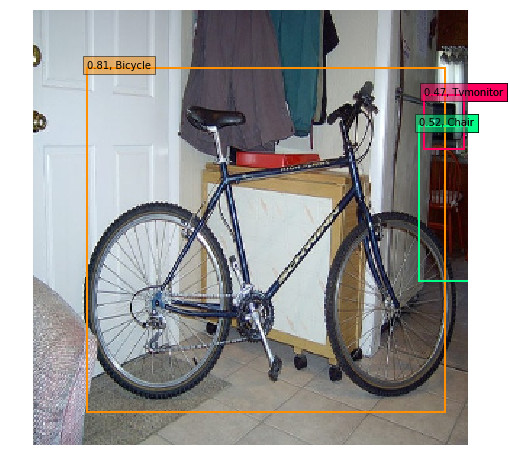
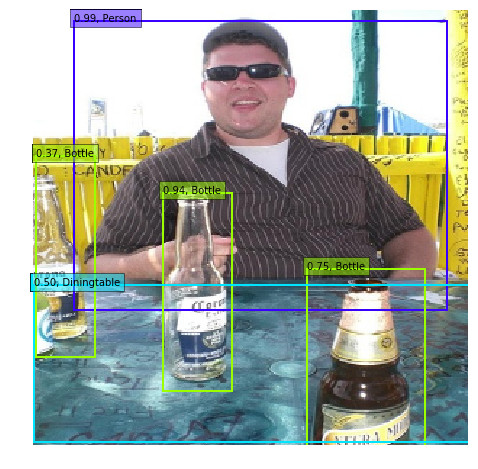
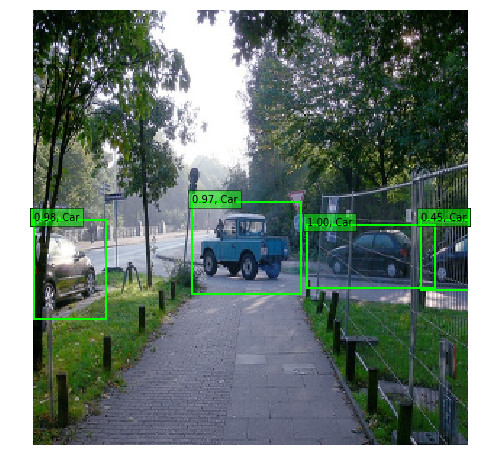

#### SegLink with DenseNet on SynthText

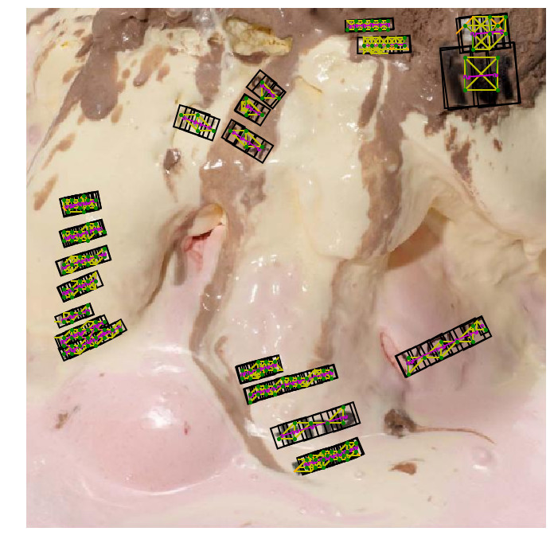
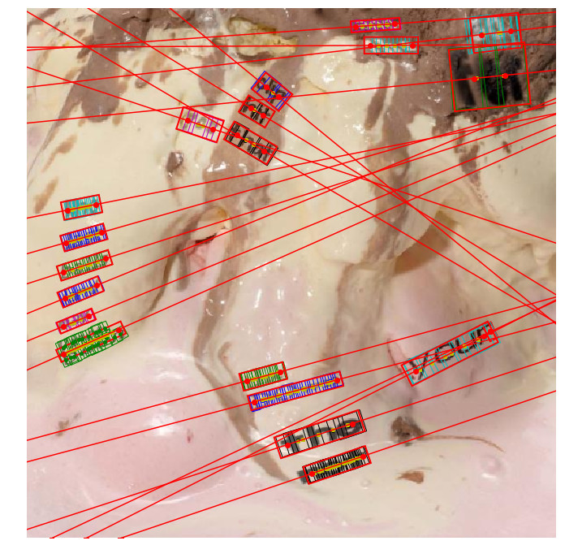

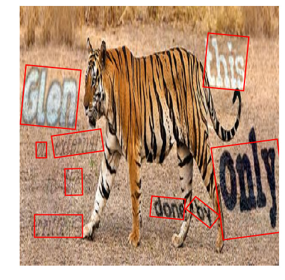
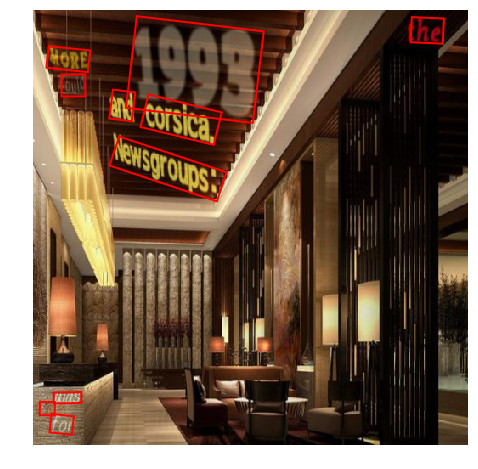
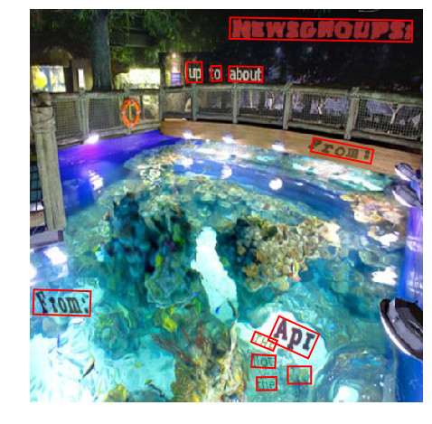

#### TextBoxes++ with DenseNet on SynthText

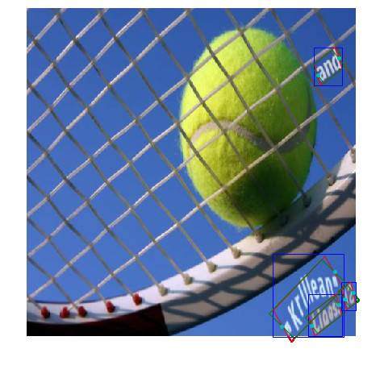
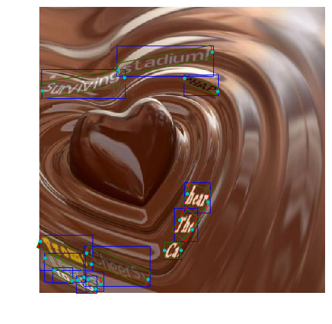
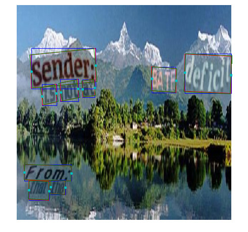

#### SegLink with DenseNet, Focal Loss and CRNN end-to-end on SynthText

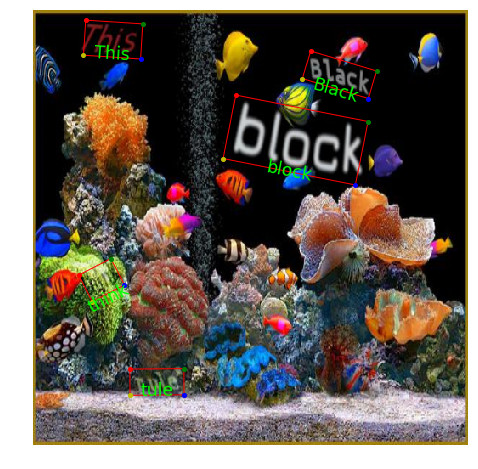
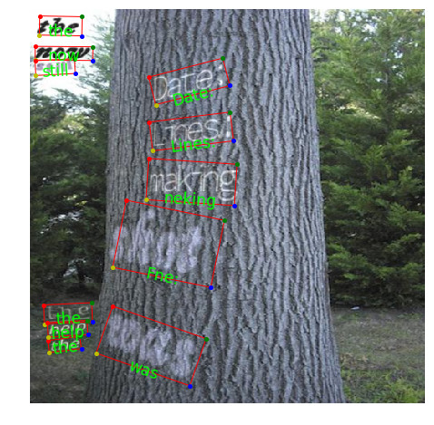
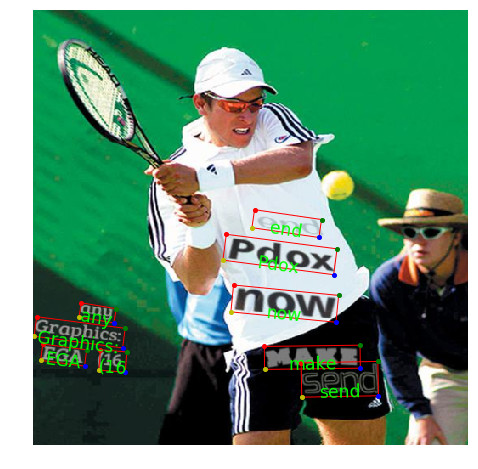

#### SegLink with DenseNet, Focal Loss and CRNN end-to-end real-time recogniton
[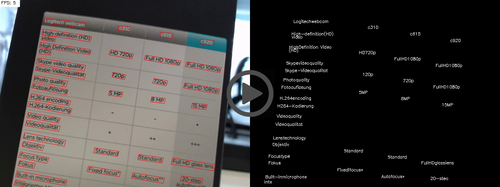](http://83.169.39.135/ssd_detectors/dsodslcrnn_end2end_record.mp4)

